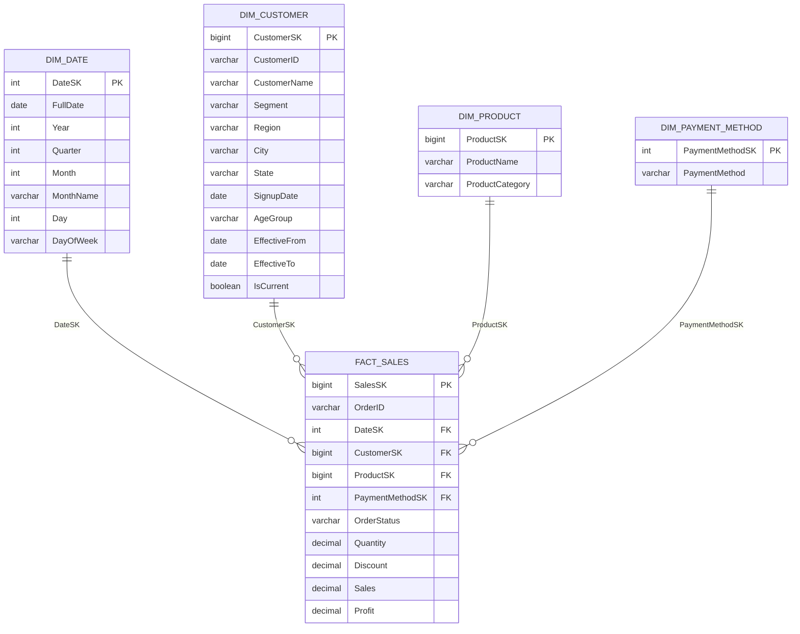

# Day 19 — Data Warehouse Design & ETL Reasoning

## Capstone Dataset

Source files:
- `Capstone_Customers.csv`
- `Capstone_Orders.csv`

### Dataset observations

The design below is based on the supplied files.

- Customers: **601 rows**
- Orders: **5,005 rows**
- Customer columns: CustomerID, CustomerName, Segment, Region, City, State, SignupDate, AgeGroup
- Order columns: OrderID, OrderDate, CustomerID, ProductCategory, Product, Quantity, Discount, Sales, Profit, PaymentMethod, OrderStatus
- Order date range: **2025-07-01 to 2026-08-31**
- Duplicate CustomerID records detected: **1**
- Duplicate OrderID records detected: **5** (the duplicate rows are exact duplicates in the supplied file)
- Orders whose CustomerID is not present in the customer master: **9**
- Text inconsistencies are present, for example casing/whitespace variations such as `electronics`, `Office supplies`, `upi`, `Net banking`, ` delivered ` and `RETURNED`.

These quality issues are intentionally handled in the **staging layer** before warehouse loading.

---

# Part A — Star Schema Design

## 1. Fact table and grain

### Fact table: `fact_sales`

**Grain:** one row represents **one cleaned order/transaction record from the source Orders dataset**.

The fact table stores numeric business measures and foreign keys to dimensions.

### Measures
- Quantity
- Discount
- Sales
- Profit

### Descriptive/degenerate attributes
- OrderID
- OrderStatus

`OrderID` is retained in the fact table as a degenerate dimension/business identifier.

---

## 2. Dimension tables

### `dim_customer`
Customer descriptive information:
- CustomerSK — surrogate primary key
- CustomerID — natural/business key
- CustomerName
- Segment
- Region
- City
- State
- SignupDate
- AgeGroup
- EffectiveFrom
- EffectiveTo
- IsCurrent

The effective-date fields support **Slowly Changing Dimension Type 2**.

### `dim_product`
Product information:
- ProductSK — surrogate primary key
- ProductName
- ProductCategory

### `dim_date`
Calendar information:
- DateSK — surrogate primary key in `YYYYMMDD` form
- FullDate
- Year
- Quarter
- Month
- MonthName
- Day
- DayOfWeek

### `dim_payment_method`
Payment attributes:
- PaymentMethodSK — surrogate primary key
- PaymentMethod

---

## 3. Star schema diagram



### Relationship direction

All relationships are **1-to-many** from dimension to fact:

- `dim_date.DateSK` → `fact_sales.DateSK`
- `dim_customer.CustomerSK` → `fact_sales.CustomerSK`
- `dim_product.ProductSK` → `fact_sales.ProductSK`
- `dim_payment_method.PaymentMethodSK` → `fact_sales.PaymentMethodSK`

---

# 4. Measures vs attributes

| Table | Column | Type | Purpose |
|---|---|---|---|
| fact_sales | Quantity | Measure | Aggregatable quantity |
| fact_sales | Discount | Measure | Aggregatable/analytical discount value/rate |
| fact_sales | Sales | Measure | Revenue measure |
| fact_sales | Profit | Measure | Profit measure |
| fact_sales | OrderID | Attribute / degenerate dimension | Business transaction identifier |
| fact_sales | OrderStatus | Attribute | Filtering/grouping |
| dim_customer | CustomerName | Attribute | Customer description |
| dim_customer | Region | Attribute | Geographic analysis |
| dim_customer | Segment | Attribute | Customer segmentation |
| dim_product | ProductName | Attribute | Product description |
| dim_product | ProductCategory | Attribute | Product grouping |
| dim_date | Year/Quarter/Month/DayOfWeek | Attribute | Time analysis |
| dim_payment_method | PaymentMethod | Attribute | Payment grouping |

---

# Day 19 Conceptual Notes

## OLTP vs OLAP

**OLTP (Online Transaction Processing)** is optimized for frequent inserts, updates and small transactional queries. It is designed to keep operational applications accurate and fast.

**OLAP (Online Analytical Processing)** is optimized for large reads, aggregations, historical analysis and reporting.

We should not normally run heavy analytics directly on the OLTP database because analytical joins, scans and aggregations can consume resources and slow down live transactions.

---

## Data Warehouse vs Data Lake vs Data Mart

- **Data Warehouse:** structured, governed data optimized for reporting and analytics.
- **Data Lake:** stores large volumes of raw or semi-structured/unstructured data in its original or near-original form.
- **Data Mart:** a smaller subject-oriented analytical store for a department or business area, such as Sales or Finance.

---

## Star Schema vs Snowflake Schema

### Star schema
A central fact table connects directly to denormalized dimension tables.

**Advantages:** simpler queries, fewer joins, easier BI reporting and faster analytical use in many scenarios.

### Snowflake schema
Dimensions are further normalized into additional related tables.

**Advantage:** reduces repeated dimension data.

For this capstone, the **star schema** is preferred because it is simple and BI-friendly.

---

## Fact vs Dimension

### Fact table
Contains measurable business events at a defined grain.

Examples:
- Sales
- Profit
- Quantity
- Discount

### Dimension table
Contains descriptive context used to filter, group and explain facts.

Examples:
- Customer
- Product
- Date
- Payment Method

---

## Granularity

Granularity means **what exactly one row represents**.

For this project:

> **One fact row = one cleaned order/transaction record from the Orders source.**

The grain must be defined before adding measures. Otherwise, measures can be double-counted.

---

## Surrogate Key vs Natural Key

**Natural key:** a business identifier coming from the source, such as `CustomerID = CUST0001`.

**Surrogate key:** a warehouse-generated identifier, such as `CustomerSK = 101`.

Surrogate keys are useful for dimensional modelling and especially for Type 2 SCD because one customer can have multiple historical dimension rows.

---

## ETL vs ELT

### ETL
**Extract → Transform → Load**

Data is transformed before it is loaded into the target warehouse.

### ELT
**Extract → Load → Transform**

Raw data is loaded first and transformations are performed inside the warehouse/lakehouse.

Modern cloud warehouses commonly support ELT because they provide strong compute resources for transformations.

---

## Staging Layer

The staging layer is a controlled landing area between source data and warehouse tables.

Typical staging tasks:
- Remove exact duplicates
- Standardize text casing and whitespace
- Validate data types
- Identify invalid quantities
- Check missing required fields
- Validate customer references
- Separate rejected/held records

Raw source data should not be loaded directly into the warehouse because bad values can contaminate dimensions and facts and make historical reporting unreliable.

---

# Part C — ETL Reasoning

## 1. Duplicate rows and inconsistent text casing

**Answer: Staging layer.**

I would extract the source data with minimal alteration and then fix duplicates and text inconsistencies in staging before loading the warehouse.

**Why:** staging provides a controlled place to validate and standardize data while preserving the original source. The warehouse should contain trusted, consistent data rather than raw inconsistencies.

Examples:
- ` electronics ` → `Electronics`
- `Office supplies` → `Office Supplies`
- `upi` → `UPI`
- ` delivered ` → `Delivered`

---

## 2. Customer moves from South to West

If Region is simply overwritten from South to West, historical reports may incorrectly show that the customer was always in West.

This breaks historical analysis such as:
- Sales by region over time
- Customer revenue by historical region
- Regional performance trends
- Customer movement analysis

### Type 2 SCD solution

Keep the old row and create a new row:

| CustomerID | Region | EffectiveFrom | EffectiveTo | IsCurrent |
|---|---|---|---|---|
| CUST0001 | South | 2025-01-01 | 2026-05-31 | 0 |
| CUST0001 | West | 2026-06-01 | 9999-12-31 | 1 |

The old warehouse row remains unchanged. A new surrogate key represents the new version.

---

## 3. Orders referencing non-existing CustomerIDs

**My choice: hold those rows in staging until the customer master issue is resolved.**

The supplied capstone data contains **9 orphan order rows**, so silently loading them would hide a referential-integrity problem.

Why hold in staging:
1. The customer is required for correct dimensional analysis.
2. An "Unknown" key can be useful as a fallback for legitimate late-arriving dimensions, but it can also hide source-system defects.
3. Rejecting immediately may lose useful records before the source issue is investigated.

Therefore, for this capstone I would:
- Keep the orphan rows in a staging/reject table.
- Report the missing CustomerIDs to the source/master-data owner.
- Load them after the customer dimension is corrected.
- Use an Unknown customer surrogate key only as an explicitly governed fallback for approved late-arriving/unknown cases.

---

# End-of-Day Check — One Sentence Answers

### Why is a star schema denormalised on purpose?
A star schema keeps dimensions relatively denormalised to reduce joins and make analytical queries and BI reporting simpler and faster.

### What is the grain of your fact table?
One row in `fact_sales` represents one cleaned order/transaction record from the source Orders dataset.

### What can break if raw data is loaded directly without staging?
Duplicate, invalid or inconsistent records can enter the warehouse and cause incorrect KPIs, broken relationships and unreliable historical analysis.

---

# Design Summary

**Source → Staging → Warehouse**

```text
Capstone Customers / Orders
            |
            v
       STAGING LAYER
  - deduplicate
  - standardize text
  - validate values
  - validate CustomerID
            |
            v
      STAR SCHEMA
            |
     +------+------+
     |             |
 Dimensions     Fact Sales
     |             |
 Customer       Measures
 Product        Sales
 Date           Profit
 Payment        Quantity
```

This design separates data quality processing from analytical storage and provides a clear model for Power BI/SQL reporting.
